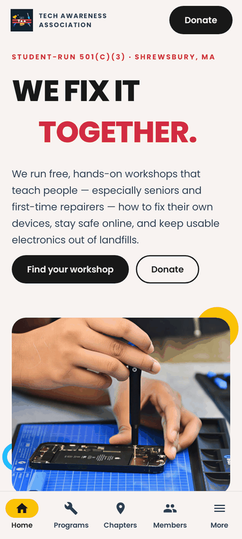
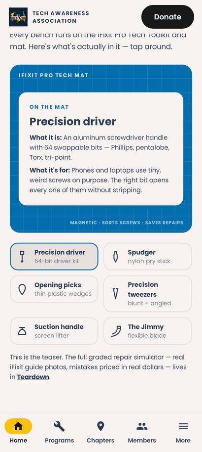
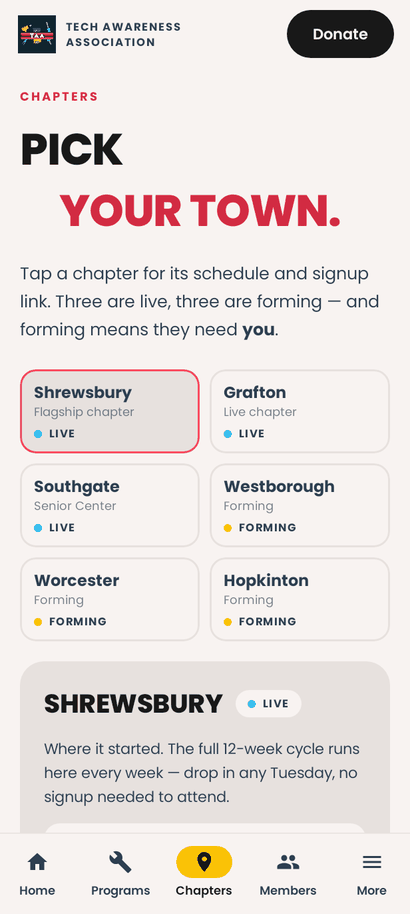
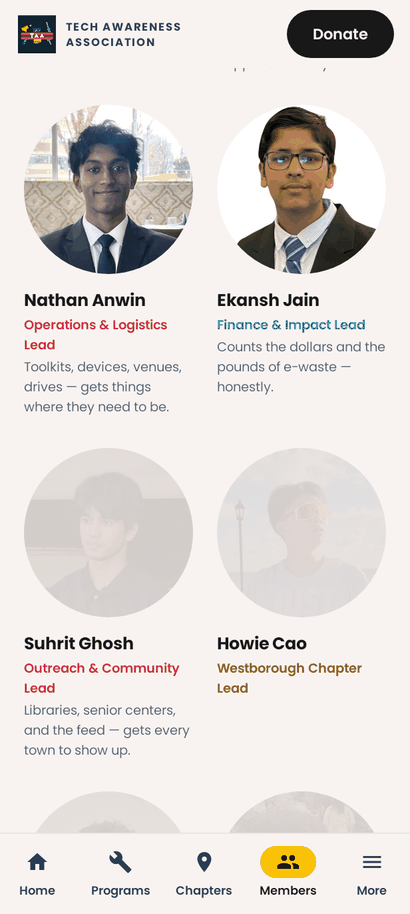
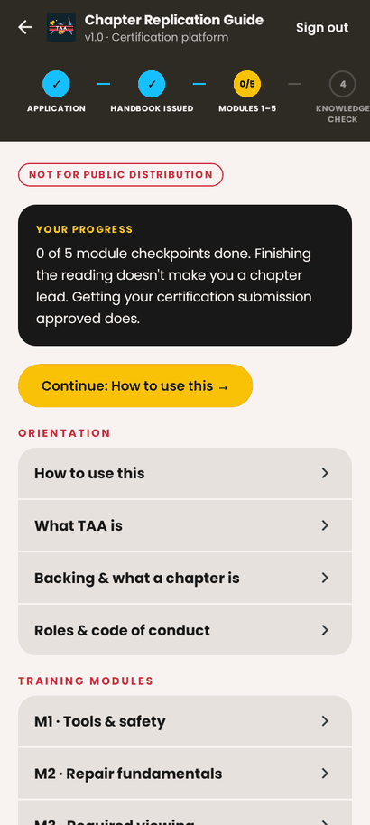
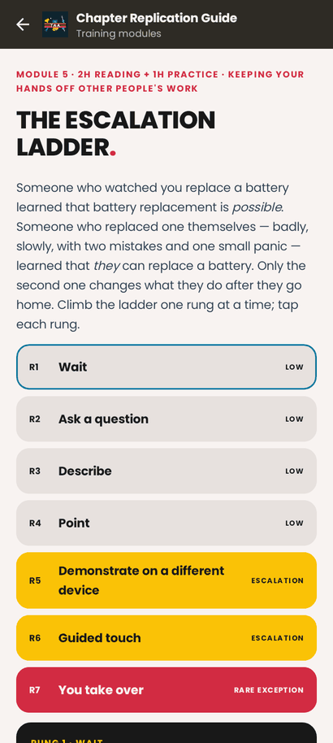

# Tech Awareness — Android app

A native Android app with the same content and features as techawarenessma.com, built
with Kotlin and Jetpack Compose. Everything is bundled: photos, fonts, timelapse videos,
and the chapter-certification course. The app works offline and has no internet permission.

<p>
  
  
  
  
  
  
</p>

## Website page → app screen

| Website | App |
| --- | --- |
| `index.html` | **Home** tab: count-up impact stats, timelapse video, tap-a-tool Pro Mat, partners, chapters, feed, newsletter, donate strip, footer |
| `Programs.dc.html` | **Programs** tab. `#workshops`, `#seniors` and `#ewaste` links open it scrolled to that program |
| `Chapters.dc.html` | **Chapters** tab: chapter picker with schedule, venue and photo |
| `Members.dc.html` | **Members** tab: photo grid, profile with "What X does" and "Next:" |
| `StartChapter.dc.html` | More → Start a Chapter, including the "Raise your hand" form |
| `GetInvolved.dc.html`, `Donate.dc.html`, `About.dc.html`, `Partners.dc.html`, `Research.dc.html`, `Projects.dc.html`, `Contact.dc.html`, `Privacy.dc.html` | Screens under **More** |
| `SiteNav.dc.html` | Top bar (logo + Donate) and the bottom tabs |
| `SiteFooter.dc.html` | Footer on Home and More |
| `Chapter Certification.dc.html` | More → Chapter Lead Certification: same `TAA-XXXX` gate, path stepper, all 12 sections, checkpoints and submission checklist, saved on the device |

Like the website, forms (newsletter, Start a Chapter) don't post anywhere. They open the
user's email app with the message filled in and addressed to contact@techawarenessma.com.

## Build and run

Requires JDK 17+ and the Android SDK (compileSdk 37). Android Studio's bundled JDK works.
The Gradle wrapper downloads everything else.

```sh
cd android
./gradlew installDebug          # build and install on a connected device or emulator
./gradlew assembleDebug         # APK at app/build/outputs/apk/debug/
./gradlew testDebugUnitTest     # unit tests + Robolectric UI tests (no device needed)
./gradlew lintDebug
```

Or open the `android/` folder in Android Studio and press Run.

### Tests

- `app/src/test/.../links`, `certification`, `navigation`, `content`, `ui/text`: plain unit
  tests for email drafts, markup, access codes, the path stepper, progress storage and routes.
- `ui/AppFlowTest`: Robolectric runs the real activity through each website feature (tabs,
  program anchors, chapter picker, member "Next", forms, links, certification gate and
  checkpoints) and asserts the email and browser intents the app fires.
- `ui/ScreenshotTourTest`: walks every screen. To write PNGs of every page to
  `app/build/outputs/roborazzi/`, run:

  ```sh
  ./gradlew :app:testDebugUnitTest --tests '*ScreenshotTourTest*' -Proborazzi.test.record=true
  ```

## Updating content

The copy lives in Kotlin, ported verbatim from each page's markup and `data` arrays:

- `content/SiteContent.kt`: tools, impact stats, chapters, members, curriculum.
- `certification/CourseContent.kt` and `certification/Certification.kt`: the course.
- Screen copy is in `ui/screens/*` and `ui/certification/*`.
- `links/Links.kt`: every email address and outside URL.

When the website changes, make the same change here. Copy supports `**bold**`, `*italic*`
and `[label](target)`, where the target is a URL, a `mailto:` link, or `app:<route>`.

Photos and videos are generated from the website's `uploads/` folder (resized, rotated,
re-encoded). After changing photos there, run this from the repository root:

```sh
python3 android/tools/import_assets.py
```

## Placeholders carried over from the website

- **GoFundMe:** the site's slot says "Campaign link pending". Set
  `Links.DONATION_CAMPAIGN_URL` and the Donate screen shows a GoFundMe button. Until then it
  offers an email.
- **Library signup links:** the site's are `#`. Set `signupUrl` on a chapter in
  `SiteContent.kt` and its "Library signup form →" button appears.
- **Certification access codes:** prototype rule, same as the site (`TAA-` plus 3 or more
  letters or digits). Part 8's 68 questions are pending the full handbook, as on the site.

## Releasing

`./gradlew assembleRelease` produces a minified, unsigned APK (about 8 MB). To publish on
Google Play, create an upload key, add a `signingConfigs` block (keep the keystore and
passwords out of git), and build an app bundle with `./gradlew bundleRelease`. A 512×512
store icon is in `store/`.

## Notes

- Package: `com.techawarenessma.app` · minSdk 26 (Android 8.0) · targetSdk 36.
- Light theme only, matching the website.
- Poppins is bundled under the SIL Open Font License (`licenses/Poppins-OFL.txt`).
